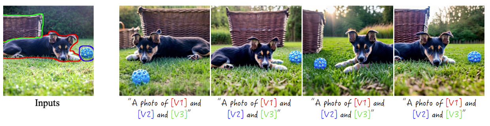
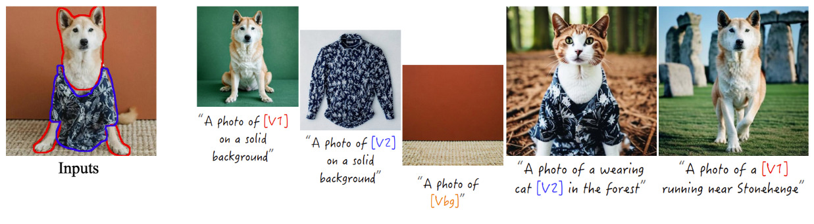
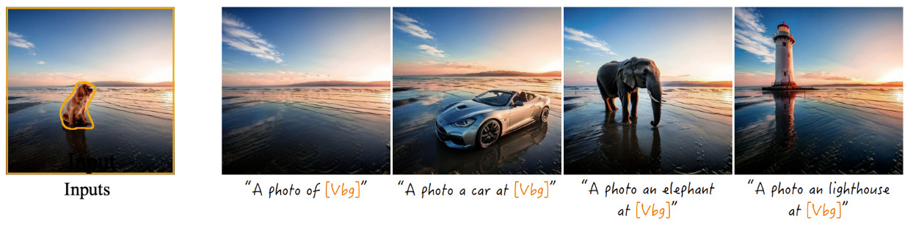
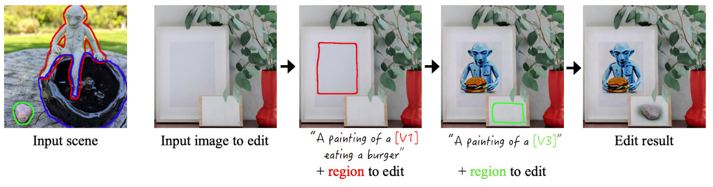

# Break-A-Scene: Extracting Multiple Concepts from a Single Image [SIGGRAPH Asia 2023]
<a href="https://omriavrahami.com/break-a-scene/"></a>
<a href="https://www.youtube.com/watch?v=-9EA-BhizgM"></a>
<a href="https://arxiv.org/abs/2305.16311"></a>
<a href="https://www.apache.org/licenses/LICENSE-2.0.txt"></a>
<a href="https://pytorch.org/">=1.13.0-Red?logo=pytorch"></a>

<a href="https://omriavrahami.com/break-a-scene/"></a>

> <a href="https://omriavrahami.com/break-a-scene/">**Break-A-Scene: Extracting Multiple Concepts from a Single Image**</a>
>
> <a href="https://omriavrahami.com/">Omri Avrahami</a>,
<a href="https://kfiraberman.github.io/">Kfir Aberman</a>,
<a href="https://www.ohadf.com/">Ohad Fried</a>,
<a href="https://danielcohenor.com/">Daniel Cohen-Or</a>,
<a href="https://www.cs.huji.ac.il/~danix/">Dani Lischinski</a>
>
> Given a single image with multiple concepts, annotated by loose segmentation masks, our method can learn a distinct token for each concept, and use natural language guidance to re-synthesize the individual concepts or combinations of them in various contexts.

## Applications

### Image Variations


### Entangled Scene Decomposition


### Background Extraction


### Local Editing by Example


# Installation
Install the conda virtual environment:
```bash
conda env create -f environment.yml
conda activate break-a-scene
conda install pytorch==1.13.1 torchvision==0.14.1 torchaudio==0.13.1 pytorch-cuda=11.7 -c pytorch -c nvidia
```

# Usage

## Step 1 - Extracting concepts from a single image
Create a new folder containing your single image named `img.jpg` and the corresponding masks, one mask per concept, e.g., `mask0.png`, `mask1.png`. You can see the example folder in `examples/creature`

Then, you train the model by running the following:
```bash
python train.py \
  --instance_data_dir INPUT_PATH  \
  --num_of_assets NUMBER_OF_CONCEPTS \
  --initializer_tokens TOKEN0 TOKEN1 TOKEN2 \
  --class_data_dir PATH_TO_PRIOR_DIR \ 
  --phase1_train_steps 400 \
  --phase2_train_steps 400 \
  --output_dir OUTPUT_DIR
```
where `--instance_data_dir` is the path to the input folder, `--num_of_assets` is the number of concepts to extract, `--initializer_tokens` is an optional list of words describing the concepts (it can be omitted, but the model may produce better results with a proper initialization), `--class_data_dir` is a path that contains general images for the prior preservation loss (if you do not have such a folder, the script will generate them for you, can be used for future executions), `--phase1_train_steps` and `--phase1_train_steps` are the number of training steps per phase, and `--output_dir` is the path to save the trained model.

For example:
```bash
python train.py \
  --instance_data_dir examples/creature  \
  --num_of_assets 3 \
  --initializer_tokens creature bowl stone \
  --class_data_dir inputs/data_dir \
  --phase1_train_steps 400 \
  --phase2_train_steps 400 \
  --output_dir outputs/creature
```

## Step 2 - Generating images
After training, a new model will be saved in `OUTPUT_DIR` with an extended vocabulary that contains the additional concepts `<asset0>` ... `<assetN>` where `N = NUMBER_OF_CONCEPTS - 1`. For example, in the above case, there will be additional 3 tokens `<asset0>`, `<asset1>` and `<asset2>`.

Now, you can generate images using:
```bash
python inference.py \
  --model_path TRAINED_MODEL_PATH \
  --prompt PROMPT \
  --output_path DESTINATION_PATH
```

For example, in the aforementioned case:
```bash
python inference.py \
  --model_path "outputs/creature" \
  --prompt "a photo of <asset0> at the beach" \
  --output_path "outputs/result.jpg"
```

Or:
```bash
python inference.py \
  --model_path "outputs/creature" \
  --prompt "an oil painting of <asset1> and <asset2>" \
  --output_path "outputs/result.jpg"
```

## Local editing by example (optional)

After extracting the concepts, if you are interested in locally editing another image, you can use [Blended Latent Diffusion](https://omriavrahami.com/blended-latent-diffusion-page/) as follows:
1. Download the image editing script `scripts/text_editing_stable_diffusion.py` from [Blended Latent Diffusion repository](https://github.com/omriav/blended-latent-diffusion).
2. Use the fine-tuned model along with the desired concept that you want to add by:
```bash
python text_editing_stable_diffusion.py \
  --model_path TRAINED_MODEL_PATH \
  --prompt PROMPT \
  --init_image THE_IMAGE_TO_EDIT \
  --mask THE_AREA_TO_EDIT \
  --output_path DESTINATION_PATH
```

For example, in the aforementioned case:
```bash
python text_editing_stable_diffusion.py \
  --model_path "outputs/creature" \
  --prompt "a photo of <asset2>" \
  --init_image "examples/chicken/img.jpg" \
  --mask "examples/chicken/mask2.png" \
  --output_path "outputs/result.jpg"
```

## Citation
If you find this useful for your research, please cite the following:
```bibtex
@inproceedings{avrahami2023bas,
  author = {Avrahami, Omri and Aberman, Kfir and Fried, Ohad and Cohen-Or, Daniel and Lischinski, Dani},
  title = {Break-A-Scene: Extracting Multiple Concepts from a Single Image},
  year = {2023},
  isbn = {9798400703157},
  publisher = {Association for Computing Machinery},
  address = {New York, NY, USA},
  url = {https://doi.org/10.1145/3610548.3618154},
  doi = {10.1145/3610548.3618154},        
  booktitle = {SIGGRAPH Asia 2023 Conference Papers},
  articleno = {96},
  numpages = {12},
  keywords = {textual inversion, multiple concept extraction, personalization},
  location = {, Sydney, NSW, Australia, },
  series = {SA '23}
}
```

## Disclaimer

This is not an officially supported Google product.